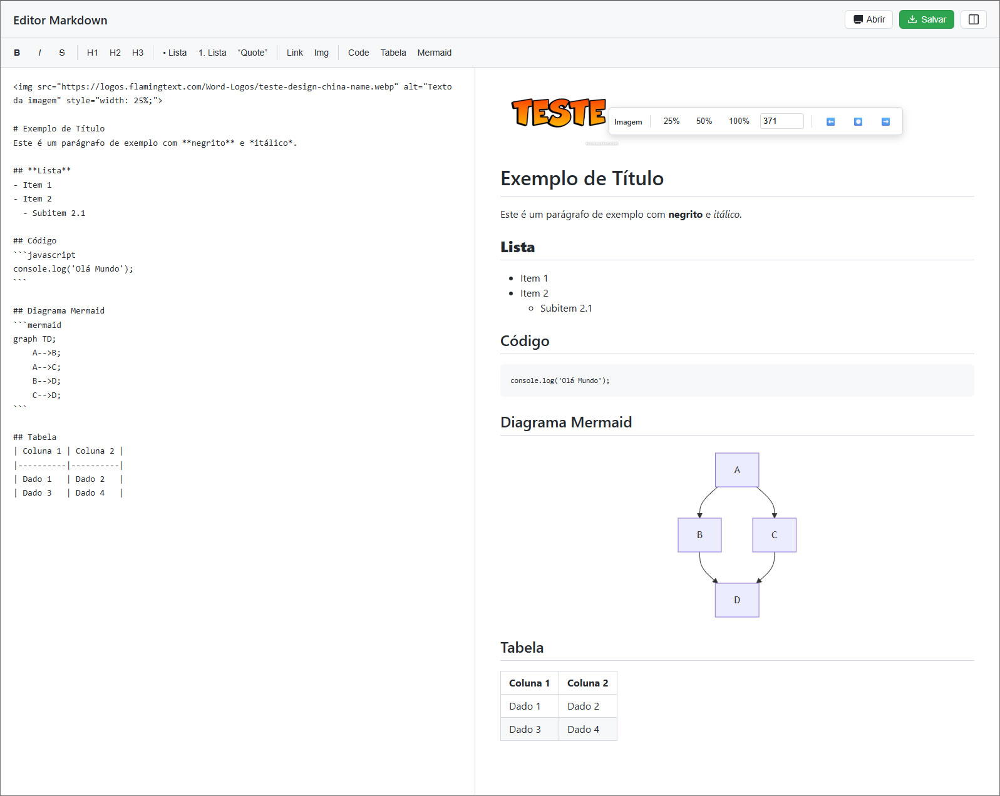
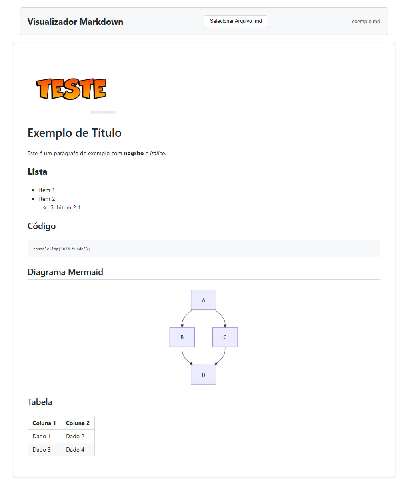

# Markdown Editor


A browser-based Markdown editor and viewer built with HTML, CSS, and vanilla JavaScript.

Editor e visualizador Markdown para navegador, desenvolvido com HTML, CSS e JavaScript vanilla.

[English](#english) | [Português](#portugues)

## English

### Overview

Markdown Editor is a static front-end project focused on editing and viewing Markdown files directly in the browser.

The project contains two independent interfaces:

- `src/editor.html`: Markdown editor with real-time preview.
- `src/viewer.html`: viewer for `.md`, `.markdown`, and `.txt` files.

### Creator

This project was created by Juliano Ballarini.

- GitHub: https://github.com/jsballarini
- LinkedIn: https://www.linkedin.com/in/juliano-ballarini-703098ba/

### Preview

Main entry points:

- Editor: `src/editor.html`
- Viewer: `src/viewer.html`
- Sample file: `src/exemplo.md`

#### Editor Screenshot



#### Viewer Screenshot



### Getting Started

#### Requirements

- A modern web browser
- Internet access for CDN dependencies

#### Run locally

1. Download or clone the project.
2. Open `src/editor.html` in your browser to use the editor.
3. Open `src/viewer.html` in your browser to use the viewer.
4. Load `src/exemplo.md` if you want a quick sample file for testing.

### Features

#### Editor

The `src/editor.html` file includes the following features:

- Split editing layout with text and preview panes.
- Three display modes:
  - editor + preview
  - editor only
  - preview only
- Toolbar for quickly inserting:
  - bold
  - italic
  - strikethrough
  - `H1`, `H2`, and `H3` headings
  - ordered and unordered lists
  - blockquotes
  - links
  - images
  - code blocks
  - tables
  - Mermaid diagrams
- Real-time preview with a 300 ms debounce.
- Basic scroll synchronization between editor and preview.
- Local file loading through the file picker.
- Drag and drop file loading.
- Saving the current content as a Markdown file.
- Page title update based on the current file name.
- Pasting images from the clipboard as `data URI`.
- Visual error handling for broken images in the preview.
- Context toolbar in the preview for:
  - resizing images in `%` or `px`
  - aligning images left, center, or right
  - applying/removing bold, italic, and strikethrough on blocks or text selections
  - aligning text blocks left, center, or right

#### Keyboard shortcuts

- `Ctrl+B` / `Cmd+B`: bold
- `Ctrl+I` / `Cmd+I`: italic
- `Ctrl+S` / `Cmd+S`: save file
- `Tab`: inserts four spaces

#### Viewer

The `src/viewer.html` file provides a simpler reading-focused experience:

- Local file selection for `.md`, `.markdown`, or `.txt`
- Basic validation of file extension and MIME type
- Markdown rendering with GFM support
- HTML sanitization before displaying content
- Conversion of ` ```mermaid ` blocks into rendered Mermaid diagrams
- Error messages for invalid files or read/render failures

### Project Structure

```text
src/
|- editor.html
|- viewer.html
|- exemplo.md
```

### Files

- `src/editor.html`: main editing interface with toolbar, synchronized preview, file open/save support, and contextual editing from the preview area
- `src/viewer.html`: simplified interface for loading a Markdown file and rendering its content
- `src/exemplo.md`: sample file containing an image, headings, lists, code block, Mermaid diagram, and table

### Dependencies

Markdown rendering relies on CDN-loaded libraries:

- `marked`: converts Markdown to HTML
- `DOMPurify`: sanitizes generated HTML
- `mermaid`: renders Mermaid diagrams

CDN endpoints used by the project:

- `https://cdn.jsdelivr.net/npm/marked/marked.min.js`
- `https://cdn.jsdelivr.net/npm/dompurify/dist/purify.min.js`
- `https://cdn.jsdelivr.net/npm/mermaid/dist/mermaid.min.js`

### Current Limitations

- There is no automatic persistence in `localStorage`
- There is no backend, authentication, or remote file synchronization
- Image resizing and alignment convert Markdown image syntax into an HTML `` tag
- Text alignment also uses HTML wrappers with `style="text-align: ..."`
- The viewer depends on manual file selection and does not support drag and drop
- External dependencies do not load in offline environments

### Roadmap

Planned improvements for future versions:

- Add optional local auto-save
- Improve offline support by bundling dependencies locally
- Add export options such as HTML or PDF
- Add drag and drop support to the viewer
- Improve mobile editing ergonomics

### Technologies

- HTML5
- CSS3
- Vanilla JavaScript
- Marked
- DOMPurify
- Mermaid

### License

This project is licensed under the MIT License. See the `LICENSE` file for the full text.

## Portugues

### Visao geral

Markdown Editor e um projeto front-end estatico focado em editar e visualizar arquivos Markdown diretamente no navegador.

O projeto contem duas interfaces independentes:

- `src/editor.html`: editor Markdown com preview em tempo real
- `src/viewer.html`: visualizador de arquivos `.md`, `.markdown` e `.txt`

### Criador

Este projeto foi criado por Juliano Ballarini.

- GitHub: https://github.com/jsballarini
- LinkedIn: https://www.linkedin.com/in/juliano-ballarini-703098ba/

### Preview

Pontos principais de entrada:

- Editor: `src/editor.html`
- Visualizador: `src/viewer.html`
- Arquivo de exemplo: `src/exemplo.md`

#### Screenshot do editor


#### Screenshot do visualizador


### Como comecar

#### Requisitos

- Navegador moderno
- Acesso a internet para carregar as dependencias via CDN

#### Executar localmente

1. Baixe ou clone o projeto.
2. Abra `src/editor.html` no navegador para usar o editor.
3. Abra `src/viewer.html` no navegador para usar o visualizador.
4. Carregue `src/exemplo.md` se quiser um arquivo rapido para teste.

### Recursos

#### Editor

O arquivo `src/editor.html` implementa os seguintes recursos:

- Layout dividido entre edicao e preview
- Tres modos de visualizacao:
  - editor + preview
  - somente editor
  - somente preview
- Toolbar para insercao rapida de:
  - negrito
  - italico
  - tachado
  - titulos `H1`, `H2` e `H3`
  - listas ordenadas e nao ordenadas
  - citacoes
  - links
  - imagens
  - blocos de codigo
  - tabelas
  - diagramas Mermaid
- Preview em tempo real com debounce de 300 ms
- Sincronizacao simples de rolagem entre editor e preview
- Abertura de arquivos locais por seletor de arquivo
- Abertura de arquivos por drag and drop
- Salvamento do conteudo atual como arquivo Markdown
- Atualizacao do titulo da pagina com base no nome do arquivo atual
- Colagem de imagens da area de transferencia como `data URI`
- Tratamento visual para imagens quebradas no preview
- Toolbar contextual no preview para:
  - redimensionar imagens em `%` ou `px`
  - alinhar imagens a esquerda, centro ou direita
  - aplicar ou remover negrito, italico e tachado em blocos ou selecoes
  - alinhar blocos de texto a esquerda, centro ou direita

#### Atalhos de teclado

- `Ctrl+B` / `Cmd+B`: negrito
- `Ctrl+I` / `Cmd+I`: italico
- `Ctrl+S` / `Cmd+S`: salvar arquivo
- `Tab`: insere quatro espacos

#### Visualizador

O arquivo `src/viewer.html` oferece uma experiencia mais simples, focada em leitura:

- Selecao de arquivo local para `.md`, `.markdown` ou `.txt`
- Validacao basica de extensao e tipo de arquivo
- Renderizacao de Markdown com suporte a GFM
- Sanitizacao do HTML antes da exibicao
- Conversao de blocos ` ```mermaid ` em diagramas Mermaid renderizados
- Mensagens de erro para arquivos invalidos ou falhas de leitura/renderizacao

### Estrutura do projeto

```text
src/
|- editor.html
|- viewer.html
|- exemplo.md
```

### Arquivos

- `src/editor.html`: interface principal de edicao com toolbar, preview sincronizado, abertura e salvamento de arquivos, e edicao contextual pela area de preview
- `src/viewer.html`: interface simplificada para carregar um arquivo Markdown e renderizar seu conteudo
- `src/exemplo.md`: arquivo de exemplo com imagem, titulos, listas, bloco de codigo, diagrama Mermaid e tabela

### Dependencias

O rendering do Markdown depende de bibliotecas carregadas por CDN:

- `marked`: converte Markdown em HTML
- `DOMPurify`: sanitiza o HTML gerado
- `mermaid`: renderiza diagramas Mermaid

Endpoints CDN usados pelo projeto:

- `https://cdn.jsdelivr.net/npm/marked/marked.min.js`
- `https://cdn.jsdelivr.net/npm/dompurify/dist/purify.min.js`
- `https://cdn.jsdelivr.net/npm/mermaid/dist/mermaid.min.js`

### Limitacoes atuais

- Nao ha persistencia automatica em `localStorage`
- Nao existe backend, autenticacao ou sincronizacao remota de arquivos
- O redimensionamento e alinhamento de imagens converte a sintaxe Markdown em uma tag HTML ``
- O alinhamento de texto tambem usa wrappers HTML com `style="text-align: ..."`
- O visualizador depende de selecao manual de arquivo e nao suporta drag and drop
- Dependencias externas nao carregam em ambientes offline

### Roadmap

Melhorias planejadas para proximas versoes:

- Adicionar auto-save local opcional
- Melhorar suporte offline com dependencias locais
- Adicionar exportacao para formatos como HTML ou PDF
- Adicionar suporte a drag and drop no visualizador
- Melhorar a experiencia de edicao em dispositivos moveis

### Tecnologias

- HTML5
- CSS3
- JavaScript vanilla
- Marked
- DOMPurify
- Mermaid

### Licenca

Este projeto esta licenciado sob a licenca MIT. Consulte o arquivo `LICENSE` para o texto completo.

