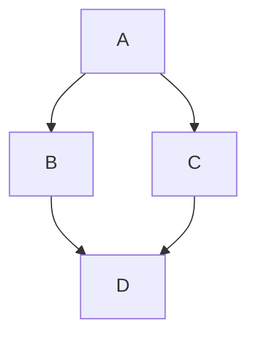

<!--
  Project: Markdown Editor
  Author: Juliano Ballarini
  GitHub: https://github.com/jsballarini
  LinkedIn: https://www.linkedin.com/in/juliano-ballarini-703098ba/
  License: MIT
  Copyright (c) 2026 Juliano Ballarini
-->


# Exemplo de Título
Este é um parágrafo de exemplo com **negrito** e *itálico*.

## **Lista**
- Item 1
- Item 2
  - Subitem 2.1

## Código
```javascript
console.log('Olá Mundo');
```

## Diagrama Mermaid


## Tabela
| Coluna 1 | Coluna 2 |
|----------|----------|
| Dado 1   | Dado 2   |
| Dado 3   | Dado 4   |

